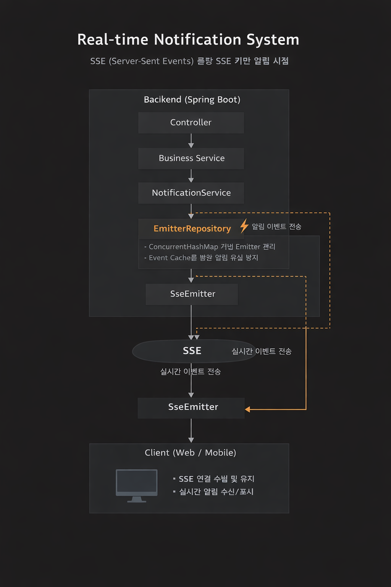

# Frans

프랜차이즈 주문 및 운영 관리 시스템

대형 치킨 프랜차이즈를 모티브로  
본사(HQ), 공급처, 가맹점 간의 운영 프로세스를 관리하기 위한 서비스입니다.

사용자는 로그인 시 DB에 저장된 역할(Role) 정보를 기반으로  
본사 직원, 공급처, 가맹점주로 구분되며  
각 사용자 유형에 맞는 기능과 화면이 제공됩니다.

서비스에서는 다음과 같은 핵심 기능을 제공합니다.

- 자재 관리
- 주문 관리
- 발주 관리
- 결재 관리
- 배송 관리
- 통계 분석
- 실시간 알림 시스템

---

# Tech Stack

- Spring Boot
- Spring Security
- JPA
- MyBatis
- SSE (Server-Sent Events)
- AWS EC2

---

# Role

프로젝트에서 다음 도메인을 담당했습니다.

### Notification Domain
- 주문 요청 및 상태 변경 이벤트 발생 시 실시간 알림 전송
- SSE(Server-Sent Events)를 활용한 실시간 알림 시스템 설계 및 구현
- 사용자별 SSE 연결을 관리하는 EmitterRepository 구현
- Event Cache를 활용하여 알림 유실 방지

### Statistics Domain
- 주문 데이터를 기반으로 한 통계 데이터 생성 및 조회 기능 구현
- Spring Scheduler를 활용한 월별 통계 데이터 자동 생성
- 원본 데이터 훼손을 방지하기 위해 별도의 통계 테이블 설계
- 사용자 역할에 따른 통계 데이터 접근 제어 구현

### CQRS 기반 조회 기능
- 조회 성능을 고려하여 CQRS 구조 적용
- Command → JPA
- Query → MyBatis

---

# Real-time Notification System (SSE)

주문 및 결재 프로세스에서 발생하는 이벤트를  
사용자에게 실시간으로 전달하기 위해  
SSE(Server-Sent Events)를 활용한 알림 시스템을 구현했습니다.

### 알림 발생 조건

- 가맹점 → 본사 주문 요청
- 본사 → 주문 상태 변경

---

# Notification Architecture

비즈니스 로직에서 알림 이벤트가 발생하면  
Notification Service가 알림을 생성하고  
SseEmitter를 통해 클라이언트에게 이벤트를 전송합니다.

EmitterRepository를 통해 사용자별 SSE 연결을 관리하고  
Event Cache를 활용하여 알림 유실을 방지했습니다.

---

# CQRS 구조

읽기와 쓰기 로직을 분리하기 위해  
CQRS(Command Query Responsibility Segregation) 구조를 적용했습니다.

Command → JPA
Query → MyBatis

---

# Statistics Domain

서비스 운영을 위한 통계 데이터를 제공하기 위해  
Statistics 도메인을 설계하고 구현했습니다.

## 통계 데이터 생성

실시간 주문 데이터를 직접 조회할 경우  
조회 성능 저하와 원본 데이터 훼손 위험이 있기 때문에  
별도의 통계 테이블을 생성하여 데이터를 관리하도록 설계했습니다.

Spring Scheduler를 활용하여  
매월 지정된 시간에 이전 달의 주문 데이터를 집계하여  
통계 테이블에 저장하도록 구현했습니다.

## Scheduler 기반 통계 생성

- Spring Scheduler를 활용한 월별 통계 배치 작업 구현
- 주문 데이터를 가공하여 통계 테이블에 저장
- 여러 통계 유형을 확장 가능하도록 StatisticsGenerator 구조 설계

이를 통해 조회 시에는  
가공된 통계 데이터를 사용하여 빠르게 통계 정보를 제공할 수 있도록 했습니다.

## 역할 기반 통계 조회

사용자의 역할(Role)에 따라 조회 가능한 통계 범위를 다르게 설계했습니다.

### 영업팀 팀원
- 자신이 담당하는 가맹점 통계 조회

### 팀장 및 상위 직급
- 부서 전체 가맹점 통계 조회

### 가맹점주
- 자신의 가맹점 통계 조회

이를 통해 사용자의 업무 범위에 맞는 통계 데이터를 제공하도록 구현했습니다.

---

# GitHub

Project Repository

https://github.com/x1-company/be14-fin-frans-be